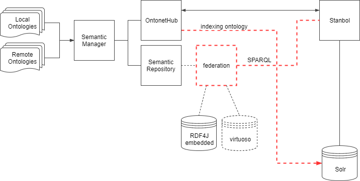

semantic_manager
=================


[DAF](https://github.com/teamdigitale/daf)

+ [semantic_manager](https://github.com/italia/daf-semantics/tree/master/semantic_manager)
	+ [semantic repository](https://github.com/italia/daf-semantics/tree/master/semantic_repository) API
		- dependencies: triplestore(s)
	+ [semantic ontonethub](https://github.com/teamdigitale/ontonethub) API
		- dependencies: stanbol (solr)
	+ [semantic validator](https://github.com/italia/daf-semantics/tree/master/semantic_validator) API
		- dependencies: triplestore(s)




* * *

## instructions

0. adjust configuration

	Currently the configurations for `semantic_repository` have been added into a section inside the general `conf/application.conf` file:

	```
	# general configurations
	clients {

		ontonethub {
			host: localhost
			port: 8000
			follow_redirects: true
			pause: 1000
		}

		...
	}
	```
	At the moment the host/port configuration of external endpoints can be changed from the configurations. 


1. compile / package

	```bash
	$ sbt clean package
	```

2. run

	```bash
	$ sbt run 
	```

3. (local, manual) deploy

	```
	$ sbt clean dist
	$ unzip -o -d  target/universal/ target/universal/semantic_manager-0.0.1.zip
	$ cd target/universal/semantic_manager-0.0.1
	$ bin/semantic-repository -Dconfig.file=./conf/application.conf
	```

	**NOTE**: if the application crashed for some reason, the pid file whould be deleted before attempting re-run 
	
	```bash
	$ rm target/universal/semantic_manager-0.0.1/RUNNING_PID 
	```

5. release

TODO

6. preparing docker image with sbt (manually)

	```bash
	$ sbt docker:publishLocal 
	```
	
	after this command, will be generated an image including the deployed application, and published on the local docker system.
	The generated image should be used for starting a new container, exposing the ports with a command similar to the following one:
	
	```
	$ sbt docker run -d -p 9000:9000 {docker-image-id}
	``


* * *

## TODO [2017-09-22]

- [x] refactorization / rewrite of API for OntonetHubClient
- [ ] refactorization / rewrite of API for SemanticRepositoryClient
- [ ] alignment between API
- [ ] more test coverage!
- [ ] REVIEW of documentation (including this README!)
- [ ] automatic guessing of MIME type from RDF file
- [ ] automatic extraction of description from RDF file
- [ ] improve documentation
